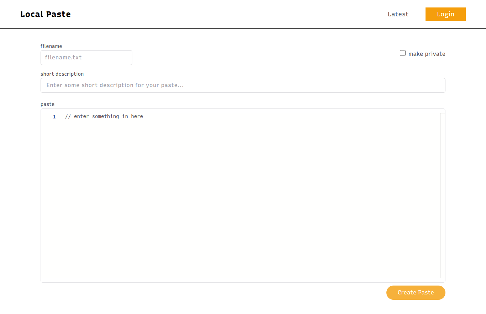

<div align="center">
    <h1>lcl-paste</h1>
    <p>Simple Paste [Bin] Manager App</p>
</div>



## Features

- Automatic Editor syntax highlighting
- Paste expiration feature
- Paste embedding
- Filename drag import (drag a file to the editor and try)
- User management (**`Auth0`**)
- Integration with other web apps (**`Carbon`**)
- API (working but may have breaking changes)

### Planned:

- Multi-file support
- ...more

## Hosting

### Deploy your own

[](https://vercel.com/new/git/external?repository-url=https%3A%2F%2Fgithub.com%2FTheBoringDude%2Flcl-paste.git&env=AUTH0_SECRET,AUTH0_BASE_URL,AUTH0_ISSUER_BASE_URL,AUTH0_CLIENT_ID,AUTH0_CLIENT_SECRET,FAUNADB_SECRET_KEY,FAUNADB_LCLPASTE_PUBLIC_KEY&envDescription=Keys%20needed%20by%20the%20application.)

1. Click the Deploy button above to clone the project and automatically host your website in **Vercel**
2. Clone your project fork to your computer
3. Make sure to fill your `.env.local` to be similar to the template (`.env.local.template`)
4. Ensure `FAUNADB_SECRET_KEY` is filled with your **Fauna Database Admin/Server Key**
5. Run the following in your terminal. (**NOTE:** Errors are not fully handled by the setup script.)
   ```bash
   yarn setup:db
   ```
   - This will create the required **`collections`**, **`indexes`** and **`roles`**

## Development

Run the development server.

    $ yarn dev

### TODO:

- ~Make `expirations` work~
- ~paste embedding~
- Improve paste deletion
- Add auto setup for automatic `fork -> deploy`
- Complete `api` endpoints
- CLEANUP & REFACTOR CODES
- ...more

## Environment Variables

```
# A long secret value used to encrypt the session cookie
AUTH0_SECRET=

# The base url of your application
AUTH0_BASE_URL=

# The url of your Auth0 tenant domain
AUTH0_ISSUER_BASE_URL=

# Your Auth0 application's Client ID
AUTH0_CLIENT_ID=

# Your Auth0 application's Client Secret
AUTH0_CLIENT_SECRET=

# FaunaDB Secret
FAUNADB_SECRET_KEY=

# FaunaDB LCL-PASTE Public Key (generate another one beside `FaunaDB Secret` one)
FAUNADB_LCLPASTE_PUBLIC_KEY=

# Your website / app url (USE: http://localhost:3000 if in development)
NEXT_PUBLIC_APP_URL=
```

### Stack

- NextJS
- Tailwind
- FaunaDB
- Auth0 (NextJS SDK)

##

### &copy; TheBoringDude | 2021
